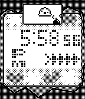
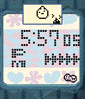
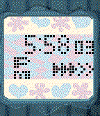
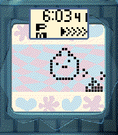
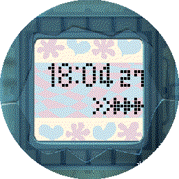
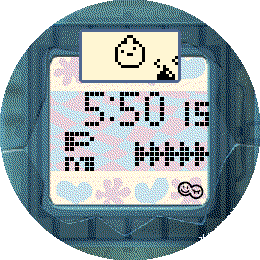

# TamaTime Watchface

Created as a companion watchface for [Tamagotchi Emulator 4 Pebble](https://github.com/StefanBauwens/Tamagotchi-Emulator-Pebble) (TE4P)

You can use it to check on your Tamagotchi without the need for the app to be on the foreground. As it also isn't doing any emulating it's much more lightweight and just fetches the data from your Tamagotchi-API server.

TamaTime can work without a server URL, where it will just behave as any regular watchface.

However, if you want you can use a link to your server + port that hosts the [Tamagotchi-API](https://github.com/StefanBauwens/Tamagotchi-API)
Do note that this will only work if you've already saved a state from TE4P to that server. In other words, if you haven't yet used the Tamagotchi Emulator with your API server there will not yet be a valid state in the server to fetch.

For more info check the readme there: https://github.com/StefanBauwens/Tamagotchi-Emulator-Pebble.

# Version Info

Version 1.1.

- Added `x-pebble-id` field in Settings to allow to be compatible with Tamagotchi-API v1.2. and above.

Version 1.0.

- Initial version.